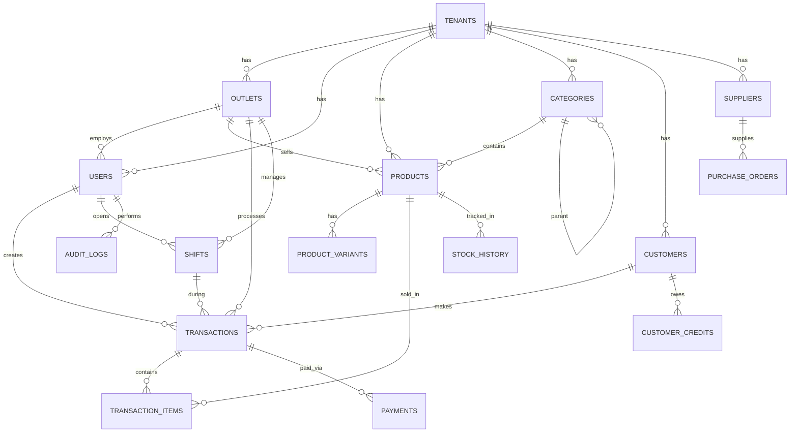

# MrikiPOS — Database Schema Detail

> Full Prisma schema dengan penjelasan setiap tabel, kolom, relasi, dan index.
> Dokumen ini adalah source of truth untuk database design.

---

## Schema Overview



---

## Prisma Schema

```prisma
// ============================================================================
// MrikiPOS — Prisma Schema
// Database: PostgreSQL 16
// Multi-tenant: shared schema, tenant_id per tabel
// ============================================================================

generator client {
  provider = "prisma-client-js"
}

datasource db {
  provider = "postgresql"
  url      = env("DATABASE_URL")
}

// ============================================================================
// ENUMS
// ============================================================================

/// Role user dalam sistem
enum UserRole {
  OWNER    // Pemilik usaha, akses penuh
  MANAGER  // Manajer, akses laporan & approval
  KASIR    // Kasir, akses POS saja
  STAFF    // Staff gudang, akses stok saja
}

/// Paket langganan tenant
enum TenantPlan {
  FREE      // Gratis: 1 outlet, 1 user, 50 produk
  UMKM      // Rp 49K/bln: 1 outlet, 3 user, unlimited produk
  BISNIS    // Rp 149K/bln: 3 outlet, 10 user, fitur lengkap
  KOMUNITAS // Custom: bundle Dinkop UKM
}

/// Status tenant
enum TenantStatus {
  ACTIVE
  SUSPENDED
  INACTIVE
}

/// Status transaksi
enum TransactionStatus {
  PENDING    // Belum dibayar / hold
  COMPLETED  // Selesai, dibayar penuh
  VOIDED     // Dibatalkan (void)
  REFUNDED   // Di-refund (sebagian/penuh)
}

/// Metode pembayaran
enum PaymentMethod {
  CASH       // Tunai
  QRIS       // QRIS (Midtrans)
  TRANSFER   // Transfer bank manual
  EWALLET    // E-wallet (OVO, GoPay, dll)
  MULTI      // Multi-tender (kombinasi)
}

/// Status pembayaran
enum PaymentStatus {
  PENDING    // Menunggu pembayaran (QRIS)
  PAID       // Sudah dibayar
  FAILED     // Gagal
  EXPIRED    // Expired (QRIS timeout)
  REFUNDED   // Di-refund
}

/// Status kasbon/piutang
enum CreditStatus {
  UNPAID     // Belum dibayar
  PAID       // Sudah lunas
  OVERDUE    // Melewati jatuh tempo
  PARTIAL    // Dibayar sebagian
}

/// Status shift kasir
enum ShiftStatus {
  OPEN       // Shift sedang berjalan
  CLOSED     // Shift sudah ditutup
}

/// Tipe mutasi stok
enum StockType {
  IN          // Barang masuk (pembelian, retur)
  OUT         // Barang keluar (penjualan, rusak)
  ADJUSTMENT  // Koreksi/adjustment (stock opname)
}

/// Status approval
enum ApprovalStatus {
  PENDING    // Menunggu approval
  APPROVED   // Disetujui
  REJECTED   // Ditolak
}

/// Tipe approval
enum ApprovalType {
  REFUND         // Refund transaksi
  VOID           // Void transaksi
  STOCK_TRANSFER // Transfer stok antar outlet
  SHIFT_CLOSE    // Tutup shift dengan selisih besar
  PRICE_CHANGE   // Perubahan harga signifikan
}

// ============================================================================
// TABEL: TENANTS
// ============================================================================

/// Tenant = 1 bisnis/organisasi. Setiap tenant bisa punya banyak outlet.
/// Ini adalah root entity untuk multi-tenancy.
model Tenant {
  id         String       @id @default(dbgenerated("gen_random_uuid()")) @db.Uuid
  nama       String       @db.VarChar(100)     // Nama usaha
  phone      String       @unique @db.VarChar(15) // Nomor HP owner (unique, untuk login)
  email      String?      @db.VarChar(100)     // Email (optional)
  plan       TenantPlan   @default(FREE)       // Paket langganan
  status     TenantStatus @default(ACTIVE)     // Status tenant
  settings   Json         @default("{}")       // Settings JSONB: receipt_header, receipt_footer, tax_rate, dll
  created_at DateTime     @default(now())
  updated_at DateTime     @updatedAt

  // Relations
  outlets         Outlet[]
  users           User[]
  categories      Category[]
  products        Product[]
  transactions    Transaction[]
  customers       Customer[]
  customerCredits CustomerCredit[]
  shifts          Shift[]
  stockHistory    StockHistory[]
  suppliers       Supplier[]
  purchaseOrders  PurchaseOrder[]
  approvalLogs    ApprovalLog[]
  auditLogs       AuditLog[]
  otpCodes        OtpCode[]

  @@map("tenants")
}

// ============================================================================
// TABEL: OUTLETS
// ============================================================================

/// Outlet = cabang/toko. Setiap tenant bisa punya 1-3 outlet tergantung paket.
/// Produk, transaksi, dan stok di-scope per outlet.
model Outlet {
  id         String   @id @default(dbgenerated("gen_random_uuid()")) @db.Uuid
  tenant_id  String   @db.Uuid
  nama       String   @db.VarChar(100)       // Nama outlet ("Outlet Pusat", "Cabang Pasar Legi")
  alamat     String?  @db.VarChar(255)       // Alamat lengkap
  kelurahan  String?  @db.VarChar(50)        // Kelurahan (21 kelurahan di Kota Blitar)
  kecamatan  String?  @db.VarChar(50)        // Kecamatan (Kepanjenkidul, Sananwetan, Sukorejo)
  latitude   Float?                          // Koordinat GPS
  longitude  Float?                          // Koordinat GPS
  is_active  Boolean  @default(true)
  created_at DateTime @default(now())
  updated_at DateTime @updatedAt

  // Relations
  tenant       Tenant        @relation(fields: [tenant_id], references: [id], onDelete: Cascade)
  users        User[]
  categories   Category[]
  products     Product[]
  transactions Transaction[]
  shifts       Shift[]
  stockHistory StockHistory[]

  @@index([tenant_id])
  @@map("outlets")
}

// ============================================================================
// TABEL: USERS
// ============================================================================

/// User = pengguna sistem. Setiap user terikat ke 1 tenant dan 1 outlet.
/// Role menentukan hak akses (RBAC).
model User {
  id         String   @id @default(dbgenerated("gen_random_uuid()")) @db.Uuid
  tenant_id  String   @db.Uuid
  outlet_id  String   @db.Uuid
  nama       String   @db.VarChar(100)       // Nama lengkap
  phone      String   @db.VarChar(15)        // Nomor HP (unique per tenant)
  pin_hash   String   @db.VarChar(100)       // PIN 6 digit, hashed bcrypt (cost 12)
  role       UserRole @default(KASIR)        // Role user
  is_active  Boolean  @default(true)         // False = user dinonaktifkan
  last_login DateTime?                       // Terakhir login
  created_at DateTime @default(now())
  updated_at DateTime @updatedAt

  // Relations
  tenant        Tenant         @relation(fields: [tenant_id], references: [id], onDelete: Cascade)
  outlet        Outlet         @relation(fields: [outlet_id], references: [id])
  transactions  Transaction[]  @relation("TransactionKasir")
  shifts        Shift[]
  refreshTokens RefreshToken[]
  auditLogs     AuditLog[]
  approvalRequested ApprovalLog[] @relation("ApprovalRequester")
  approvalApproved  ApprovalLog[] @relation("ApprovalApprover")

  @@unique([tenant_id, phone])    // Phone unique per tenant
  @@index([tenant_id, outlet_id])
  @@map("users")
}

// ============================================================================
// TABEL: CATEGORIES
// ============================================================================

/// Kategori produk. Support hierarki (parent-child) untuk sub-kategori.
/// Contoh: Makanan > Nasi, Makanan > Gorengan
model Category {
  id         String   @id @default(dbgenerated("gen_random_uuid()")) @db.Uuid
  tenant_id  String   @db.Uuid
  outlet_id  String   @db.Uuid
  nama       String   @db.VarChar(50)        // Nama kategori ("Makanan", "Minuman")
  parent_id  String?  @db.Uuid               // FK ke category parent (null = root)
  sort_order Int      @default(0)            // Urutan tampil
  is_active  Boolean  @default(true)
  created_at DateTime @default(now())
  updated_at DateTime @updatedAt

  // Relations
  tenant   Tenant     @relation(fields: [tenant_id], references: [id], onDelete: Cascade)
  outlet   Outlet     @relation(fields: [outlet_id], references: [id])
  parent   Category?  @relation("CategoryHierarchy", fields: [parent_id], references: [id])
  children Category[] @relation("CategoryHierarchy")
  products Product[]

  @@index([tenant_id, outlet_id])
  @@map("categories")
}

// ============================================================================
// TABEL: PRODUCTS
// ============================================================================

/// Produk yang dijual. Setiap produk terikat ke 1 tenant, 1 outlet, dan 1 kategori.
/// Mendukung barcode, SKU, varian, dan stok tracking.
model Product {
  id            String   @id @default(dbgenerated("gen_random_uuid()")) @db.Uuid
  tenant_id     String   @db.Uuid
  outlet_id     String   @db.Uuid
  category_id   String?  @db.Uuid             // FK ke categories (optional)
  nama          String   @db.VarChar(100)      // Nama produk ("Nasi Pecel")
  sku           String?  @db.VarChar(50)       // Stock Keeping Unit ("NP-001")
  barcode       String?  @db.VarChar(50)       // Barcode (EAN-8, EAN-13, Code-128)
  harga_jual    Decimal  @db.Decimal(12, 2)    // Harga jual (Rp) — max 9.999.999.999,99
  harga_beli    Decimal? @db.Decimal(12, 2)    // Harga beli/HPP (untuk hitung laba)
  stok          Int      @default(0)           // Stok saat ini
  stok_minimum  Int      @default(5)           // Alert jika stok di bawah ini
  satuan        String?  @db.VarChar(20)       // Satuan ("porsi", "pcs", "kg", "liter")
  foto_url      String?  @db.VarChar(500)      // URL foto produk (Cloudflare R2)
  is_active     Boolean  @default(true)
  created_at    DateTime @default(now())
  updated_at    DateTime @updatedAt

  // Relations
  tenant           Tenant            @relation(fields: [tenant_id], references: [id], onDelete: Cascade)
  outlet           Outlet            @relation(fields: [outlet_id], references: [id])
  category         Category?         @relation(fields: [category_id], references: [id])
  variants         ProductVariant[]
  transactionItems TransactionItem[]
  stockHistory     StockHistory[]

  @@index([tenant_id, outlet_id])
  @@index([barcode])
  @@index([tenant_id, category_id])
  @@map("products")
}

// ============================================================================
// TABEL: PRODUCT_VARIANTS
// ============================================================================

/// Varian produk. Contoh: Nasi Pecel → Extra Sambal (Rp 17.000), Nasi Pecel → Paket Hemat (Rp 20.000)
/// Setiap varian punya harga dan stok sendiri.
model ProductVariant {
  id          String  @id @default(dbgenerated("gen_random_uuid()")) @db.Uuid
  product_id  String  @db.Uuid
  nama        String  @db.VarChar(50)        // Nama varian ("Extra Sambal", "Large")
  sku         String? @db.VarChar(50)        // SKU varian
  harga_jual  Decimal @db.Decimal(12, 2)     // Harga jual varian
  stok        Int     @default(0)            // Stok varian
  is_active   Boolean @default(true)
  created_at  DateTime @default(now())

  // Relations
  product          Product           @relation(fields: [product_id], references: [id], onDelete: Cascade)
  transactionItems TransactionItem[]

  @@index([product_id])
  @@map("product_variants")
}

// ============================================================================
// TABEL: TRANSACTIONS
// ============================================================================

/// Transaksi penjualan. 1 transaksi = 1 struk.
/// Bisa dibuat offline (synced_at = null sampai berhasil sync).
model Transaction {
  id            String            @id @default(dbgenerated("gen_random_uuid()")) @db.Uuid
  tenant_id     String            @db.Uuid
  outlet_id     String            @db.Uuid
  shift_id      String?           @db.Uuid    // FK ke shift yang aktif saat transaksi
  kasir_id      String            @db.Uuid    // FK ke user (kasir yang melayani)
  customer_id   String?           @db.Uuid    // FK ke customer (optional)
  nomor         String            @db.VarChar(30) // Nomor transaksi ("TXN-20260721-001")
  subtotal      Decimal           @db.Decimal(12, 2) // Total sebelum diskon & pajak
  diskon        Decimal           @default(0) @db.Decimal(12, 2) // Diskon transaksi
  pajak         Decimal           @default(0) @db.Decimal(12, 2) // Pajak (jika enabled)
  grand_total   Decimal           @db.Decimal(12, 2) // Total final (subtotal - diskon + pajak)
  metode_bayar  PaymentMethod     @default(CASH)
  status        TransactionStatus @default(PENDING)
  catatan       String?           @db.VarChar(255) // Catatan ("Meja 3", "Bungkus")
  local_id      String?           @db.VarChar(100) // ID lokal dari device (untuk offline sync)
  created_at    DateTime          @default(now())   // Waktu transaksi dibuat
  synced_at     DateTime?                           // Waktu sync ke server (null = belum sync/online)
  updated_at    DateTime          @updatedAt

  // Relations
  tenant   Tenant            @relation(fields: [tenant_id], references: [id], onDelete: Cascade)
  outlet   Outlet            @relation(fields: [outlet_id], references: [id])
  shift    Shift?            @relation(fields: [shift_id], references: [id])
  kasir    User              @relation("TransactionKasir", fields: [kasir_id], references: [id])
  customer Customer?         @relation(fields: [customer_id], references: [id])
  items    TransactionItem[]
  payments Payment[]

  @@index([tenant_id, created_at(sort: Desc)])
  @@index([outlet_id, shift_id])
  @@index([nomor])
  @@index([local_id])
  @@map("transactions")
}

// ============================================================================
// TABEL: TRANSACTION_ITEMS
// ============================================================================

/// Item dalam transaksi. 1 transaksi bisa punya banyak item.
/// Menyimpan snapshot nama & harga saat transaksi (agar tidak berubah jika produk di-edit).
model TransactionItem {
  id              String  @id @default(dbgenerated("gen_random_uuid()")) @db.Uuid
  transaction_id  String  @db.Uuid
  product_id      String  @db.Uuid
  variant_id      String? @db.Uuid
  nama_produk     String  @db.VarChar(100)      // Snapshot nama produk saat transaksi
  qty             Int                           // Jumlah item
  harga           Decimal @db.Decimal(12, 2)    // Harga per item saat transaksi
  diskon_item     Decimal @default(0) @db.Decimal(12, 2) // Diskon per item
  subtotal        Decimal @db.Decimal(12, 2)    // (harga * qty) - diskon_item
  catatan         String? @db.VarChar(255)      // Catatan item ("tanpa sambal")

  // Relations
  transaction Transaction    @relation(fields: [transaction_id], references: [id], onDelete: Cascade)
  product     Product         @relation(fields: [product_id], references: [id])
  variant     ProductVariant? @relation(fields: [variant_id], references: [id])

  @@index([transaction_id])
  @@map("transaction_items")
}

// ============================================================================
// TABEL: PAYMENTS
// ============================================================================

/// Pembayaran untuk transaksi. 1 transaksi bisa punya banyak payment (multi-tender).
/// Contoh: Rp 50.000 tunai + Rp 33.000 QRIS = 2 payment records.
model Payment {
  id               String        @id @default(dbgenerated("gen_random_uuid()")) @db.Uuid
  transaction_id   String        @db.Uuid
  metode           PaymentMethod
  jumlah           Decimal       @db.Decimal(12, 2)    // Jumlah yang dibayar
  status           PaymentStatus @default(PENDING)
  referensi        String?       @db.VarChar(100)      // Reference number / QR code ID
  gateway_response Json?                               // Raw response dari payment gateway
  created_at       DateTime      @default(now())
  updated_at       DateTime      @updatedAt

  // Relations
  transaction Transaction @relation(fields: [transaction_id], references: [id], onDelete: Cascade)

  @@index([transaction_id])
  @@map("payments")
}

// ============================================================================
// TABEL: CUSTOMERS
// ============================================================================

/// Database pelanggan. Untuk kasbon, poin, dan riwayat belanja.
model Customer {
  id             String   @id @default(dbgenerated("gen_random_uuid()")) @db.Uuid
  tenant_id      String   @db.Uuid
  outlet_id      String   @db.Uuid
  nama           String   @db.VarChar(100)      // Nama pelanggan
  phone          String?  @db.VarChar(15)       // Nomor HP
  alamat         String?  @db.VarChar(255)      // Alamat
  total_belanja  Decimal  @default(0) @db.Decimal(12, 2) // Akumulasi total belanja
  poin           Int      @default(0)           // Poin loyalty
  created_at     DateTime @default(now())
  updated_at     DateTime @updatedAt

  // Relations
  tenant       Tenant           @relation(fields: [tenant_id], references: [id], onDelete: Cascade)
  transactions Transaction[]
  credits      CustomerCredit[]

  @@index([tenant_id, outlet_id])
  @@index([tenant_id, phone])
  @@map("customers")
}

// ============================================================================
// TABEL: CUSTOMER_CREDITS (KASBON)
// ============================================================================

/// Kasbon / piutang pelanggan. Fitur paling diminta UMKM.
/// Setiap record = 1 transaksi kasbon. Bisa punya jatuh tempo & reminder WA.
model CustomerCredit {
  id           String       @id @default(dbgenerated("gen_random_uuid()")) @db.Uuid
  tenant_id    String       @db.Uuid
  outlet_id    String       @db.Uuid
  customer_id  String       @db.Uuid
  jumlah       Decimal      @db.Decimal(12, 2)   // Jumlah kasbon
  sisa         Decimal      @db.Decimal(12, 2)   // Sisa yang belum dibayar
  keterangan   String?      @db.VarChar(255)     // Keterangan ("Belanja sembako 20 Juli")
  jatuh_tempo  DateTime?    @db.Date             // Tanggal jatuh tempo
  status       CreditStatus @default(UNPAID)
  paid_at      DateTime?                         // Tanggal lunas
  created_at   DateTime     @default(now())
  updated_at   DateTime     @updatedAt

  // Relations
  tenant   Tenant   @relation(fields: [tenant_id], references: [id], onDelete: Cascade)
  customer Customer @relation(fields: [customer_id], references: [id])

  @@index([tenant_id, status])
  @@index([customer_id])
  @@index([jatuh_tempo])
  @@map("customer_credits")
}

// ============================================================================
// TABEL: SHIFTS
// ============================================================================

/// Shift kasir. Setiap kasir buka shift di awal kerja, tutup di akhir.
/// Mencatat modal awal, total penjualan, dan selisih kas.
model Shift {
  id                String      @id @default(dbgenerated("gen_random_uuid()")) @db.Uuid
  tenant_id         String      @db.Uuid
  outlet_id         String      @db.Uuid
  user_id           String      @db.Uuid           // Kasir yang buka shift
  modal_awal        Decimal     @db.Decimal(12, 2)  // Modal awal di kasir (Rp)
  total_penjualan   Decimal     @default(0) @db.Decimal(12, 2) // Total penjualan selama shift
  total_transaksi   Int         @default(0)         // Jumlah transaksi selama shift
  kas_aktual        Decimal?    @db.Decimal(12, 2)  // Kas yang dihitung saat tutup shift
  selisih_kas       Decimal?    @db.Decimal(12, 2)  // Selisih (kas_aktual - expected)
  catatan           String?     @db.VarChar(255)    // Catatan saat tutup shift
  status            ShiftStatus @default(OPEN)
  opened_at         DateTime    @default(now())
  closed_at         DateTime?
  updated_at        DateTime    @updatedAt

  // Relations
  tenant       Tenant        @relation(fields: [tenant_id], references: [id], onDelete: Cascade)
  outlet       Outlet        @relation(fields: [outlet_id], references: [id])
  user         User          @relation(fields: [user_id], references: [id])
  transactions Transaction[]

  @@index([tenant_id, outlet_id])
  @@index([user_id, status])
  @@map("shifts")
}

// ============================================================================
// TABEL: STOCK_HISTORY
// ============================================================================

/// Riwayat mutasi stok. Setiap perubahan stok dicatat di sini.
/// Tipe: IN (barang masuk), OUT (penjualan/rusak), ADJUSTMENT (stock opname).
model StockHistory {
  id            String    @id @default(dbgenerated("gen_random_uuid()")) @db.Uuid
  tenant_id     String    @db.Uuid
  outlet_id     String    @db.Uuid
  product_id    String    @db.Uuid
  tipe          StockType                         // IN, OUT, ADJUSTMENT
  qty           Int                               // Jumlah perubahan (positif/negatif)
  stok_sebelum  Int                               // Stok sebelum perubahan
  stok_sesudah  Int                               // Stok setelah perubahan
  keterangan    String?   @db.VarChar(255)        // Alasan perubahan
  reference_id  String?   @db.Uuid                // FK ke transaksi/PO yang menyebabkan perubahan
  created_at    DateTime  @default(now())

  // Relations
  tenant  Tenant  @relation(fields: [tenant_id], references: [id], onDelete: Cascade)
  outlet  Outlet  @relation(fields: [outlet_id], references: [id])
  product Product @relation(fields: [product_id], references: [id])

  @@index([product_id, created_at(sort: Desc)])
  @@index([tenant_id, outlet_id])
  @@map("stock_history")
}

// ============================================================================
// TABEL: SUPPLIERS
// ============================================================================

/// Supplier/pemasok. Untuk fitur Purchase Order (P1).
model Supplier {
  id         String   @id @default(dbgenerated("gen_random_uuid()")) @db.Uuid
  tenant_id  String   @db.Uuid
  nama       String   @db.VarChar(100)
  phone      String?  @db.VarChar(15)
  alamat     String?  @db.VarChar(255)
  is_active  Boolean  @default(true)
  created_at DateTime @default(now())
  updated_at DateTime @updatedAt

  // Relations
  tenant         Tenant          @relation(fields: [tenant_id], references: [id], onDelete: Cascade)
  purchaseOrders PurchaseOrder[]

  @@index([tenant_id])
  @@map("suppliers")
}

// ============================================================================
// TABEL: PURCHASE_ORDERS
// ============================================================================

/// Purchase Order ke supplier. Untuk tracking pembelian bahan baku (P1).
model PurchaseOrder {
  id          String   @id @default(dbgenerated("gen_random_uuid()")) @db.Uuid
  tenant_id   String   @db.Uuid
  outlet_id   String   @db.Uuid
  supplier_id String   @db.Uuid
  nomor       String   @db.VarChar(30)        // Nomor PO ("PO-20260721-001")
  total       Decimal  @db.Decimal(12, 2)
  status      String   @default("DRAFT") @db.VarChar(20) // DRAFT, ORDERED, RECEIVED, CANCELLED
  catatan     String?  @db.VarChar(255)
  created_at  DateTime @default(now())
  updated_at  DateTime @updatedAt

  // Relations
  tenant   Tenant   @relation(fields: [tenant_id], references: [id], onDelete: Cascade)
  supplier Supplier @relation(fields: [supplier_id], references: [id])

  @@index([tenant_id, outlet_id])
  @@map("purchase_orders")
}

// ============================================================================
// TABEL: APPROVAL_LOGS
// ============================================================================

/// Log approval untuk aksi yang butuh persetujuan (refund, void, dll).
/// Multi-level approval berdasarkan nominal (P1).
model ApprovalLog {
  id             String         @id @default(dbgenerated("gen_random_uuid()")) @db.Uuid
  tenant_id      String         @db.Uuid
  type           ApprovalType                    // REFUND, VOID, STOCK_TRANSFER, dll
  reference_id   String         @db.Uuid         // FK ke entity yang di-approve
  requested_by   String         @db.Uuid         // User yang request
  approved_by    String?        @db.Uuid         // User yang approve/reject
  status         ApprovalStatus @default(PENDING)
  catatan        String?        @db.VarChar(255) // Alasan approve/reject
  created_at     DateTime       @default(now())
  updated_at     DateTime       @updatedAt

  // Relations
  tenant    Tenant @relation(fields: [tenant_id], references: [id], onDelete: Cascade)
  requester User   @relation("ApprovalRequester", fields: [requested_by], references: [id])
  approver  User?  @relation("ApprovalApprover", fields: [approved_by], references: [id])

  @@index([tenant_id, status])
  @@map("approval_logs")
}

// ============================================================================
// TABEL: AUDIT_LOGS
// ============================================================================

/// Audit trail untuk semua aksi sensitif. Immutable — tidak boleh di-update/delete.
/// Digunakan untuk compliance, debugging, dan security monitoring.
model AuditLog {
  id          String   @id @default(dbgenerated("gen_random_uuid()")) @db.Uuid
  tenant_id   String   @db.Uuid
  user_id     String   @db.Uuid             // User yang melakukan aksi
  action      String   @db.VarChar(50)      // "CREATE", "UPDATE", "DELETE", "LOGIN", "REFUND", dll
  entity_type String   @db.VarChar(50)      // "product", "transaction", "user", dll
  entity_id   String?  @db.Uuid             // ID entity yang di-aksi
  old_values  Json?                         // Snapshot value sebelum perubahan
  new_values  Json?                         // Snapshot value setelah perubahan
  ip_address  String?  @db.VarChar(45)      // IP address (IPv4 atau IPv6)
  user_agent  String?  @db.VarChar(255)     // Browser/device info
  created_at  DateTime @default(now())

  // Relations
  tenant Tenant @relation(fields: [tenant_id], references: [id], onDelete: Cascade)
  user   User   @relation(fields: [user_id], references: [id])

  // TIDAK ADA updatedAt — audit log immutable!

  @@index([tenant_id, created_at(sort: Desc)])
  @@index([tenant_id, entity_type, entity_id])
  @@map("audit_logs")
}

// ============================================================================
// TABEL: OTP_CODES
// ============================================================================

/// Kode OTP untuk verifikasi WhatsApp. Code disimpan sebagai hash (bcrypt).
/// Expired setelah 5 menit, max 3 attempts.
model OtpCode {
  id         String   @id @default(dbgenerated("gen_random_uuid()")) @db.Uuid
  tenant_id  String?  @db.Uuid               // Null untuk registrasi baru (tenant belum ada)
  phone      String   @db.VarChar(15)         // Nomor HP tujuan
  code_hash  String   @db.VarChar(100)        // OTP code, hashed (bcrypt)
  type       String   @db.VarChar(20)         // "register", "login", "forgot_pin"
  attempts   Int      @default(0)             // Jumlah percobaan verifikasi
  verified   Boolean  @default(false)         // Sudah diverifikasi?
  expires_at DateTime                         // Waktu expired
  created_at DateTime @default(now())

  // Relations
  tenant Tenant? @relation(fields: [tenant_id], references: [id], onDelete: Cascade)

  @@index([phone, type])
  @@index([expires_at])
  @@map("otp_codes")
}

// ============================================================================
// TABEL: REFRESH_TOKENS
// ============================================================================

/// Refresh token untuk JWT rotation. Disimpan hashed, direvoke setelah digunakan.
/// Juga dicache di Redis untuk fast lookup.
model RefreshToken {
  id         String   @id @default(dbgenerated("gen_random_uuid()")) @db.Uuid
  user_id    String   @db.Uuid
  token_hash String   @db.VarChar(100)        // Refresh token, hashed
  expires_at DateTime                         // Waktu expired (7 hari)
  revoked    Boolean  @default(false)         // True = token sudah tidak valid
  revoked_at DateTime?                        // Waktu direvoke
  created_at DateTime @default(now())

  // Relations
  user User @relation(fields: [user_id], references: [id], onDelete: Cascade)

  @@index([user_id])
  @@index([token_hash])
  @@map("refresh_tokens")
}
```

---

## Index Strategy

### Composite Indexes

Semua tabel utama punya composite index `(tenant_id, ...)` sebagai kolom pertama karena:

1. **Multi-tenant isolation** — setiap query selalu filter by tenant_id
2. **PostgreSQL B-tree** — index prefix matching, tenant_id di depan efisien
3. **Partition-ready** — jika nanti partition by tenant_id, index sudah aligned

### Partial Indexes

```sql
-- Barcode hanya di-index jika tidak null (banyak produk tanpa barcode)
CREATE INDEX idx_products_barcode ON products(barcode) WHERE barcode IS NOT NULL;

-- Hanya cari credit yang belum dibayar
CREATE INDEX idx_credits_unpaid ON customer_credits(tenant_id, jatuh_tempo)
  WHERE status IN ('UNPAID', 'OVERDUE');

-- Hanya cari shift yang masih open
CREATE INDEX idx_shifts_open ON shifts(user_id) WHERE status = 'OPEN';
```

### Foreign Key Cascade Rules

| Relasi                        | ON DELETE | Alasan                                         |
| ----------------------------- | --------- | ---------------------------------------------- |
| Tenant → Outlet               | CASCADE   | Hapus tenant = hapus semua data                |
| Tenant → User                 | CASCADE   | Same                                           |
| Outlet → Product              | RESTRICT  | Jangan hapus outlet yang masih punya produk    |
| Product → TransactionItem     | RESTRICT  | Jangan hapus produk yang pernah ditransaksikan |
| Transaction → TransactionItem | CASCADE   | Hapus transaksi = hapus items                  |
| Transaction → Payment         | CASCADE   | Hapus transaksi = hapus payments               |

---

## Data Type Choices

| Tipe            | Column                                     | Alasan                                           |
| --------------- | ------------------------------------------ | ------------------------------------------------ |
| `UUID`          | Semua PK                                   | Distributed-friendly, tidak expose sequential ID |
| `Decimal(12,2)` | Semua kolom uang                           | Presisi desimal, max Rp 9.999.999.999,99         |
| `VarChar(N)`    | String                                     | Explicit limit, hemat storage vs TEXT            |
| `JSONB`         | settings, gateway_response, old/new_values | Flexible schema, indexable                       |
| `DateTime`      | Timestamp                                  | Timezone-aware, ISO 8601                         |
| `Date`          | jatuh_tempo                                | Tanpa waktu, hanya tanggal                       |
| `Int`           | stok, qty, poin                            | Integer, tidak perlu desimal                     |
| `Boolean`       | is_active, verified, revoked               | Simple flag                                      |

---

## Settings JSONB Schema (Tenant)

```typescript
interface TenantSettings {
  // Receipt
  receipt_header: string; // "WARUNG NASI PECEL BU SITI"
  receipt_footer: string; // "Terima kasih!"
  receipt_show_address: boolean;
  receipt_show_phone: boolean;

  // Tax
  tax_enabled: boolean;
  tax_rate: number; // 0.005 (0.5% PPh UMKM)
  tax_inclusive: boolean; // Harga sudah termasuk pajak?

  // POS
  pos_default_payment: PaymentMethod; // "CASH"
  pos_allow_negative_stock: boolean; // Boleh jual walau stok 0?
  pos_auto_print_receipt: boolean;

  // Notification
  notify_low_stock: boolean;
  notify_daily_report: boolean;
  notify_credit_reminder: boolean;

  // Timezone & Locale
  timezone: string; // "Asia/Jakarta"
  currency: string; // "IDR"
}
```

---

_Schema ini adalah source of truth. Setiap perubahan HARUS melalui Prisma migration (`prisma migrate dev`) dan di-document di sini._
